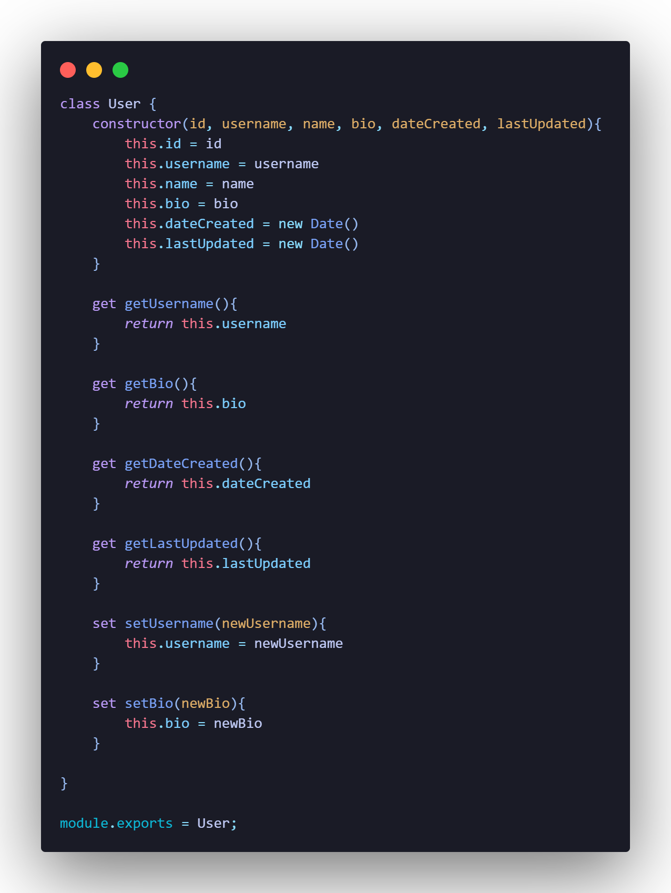
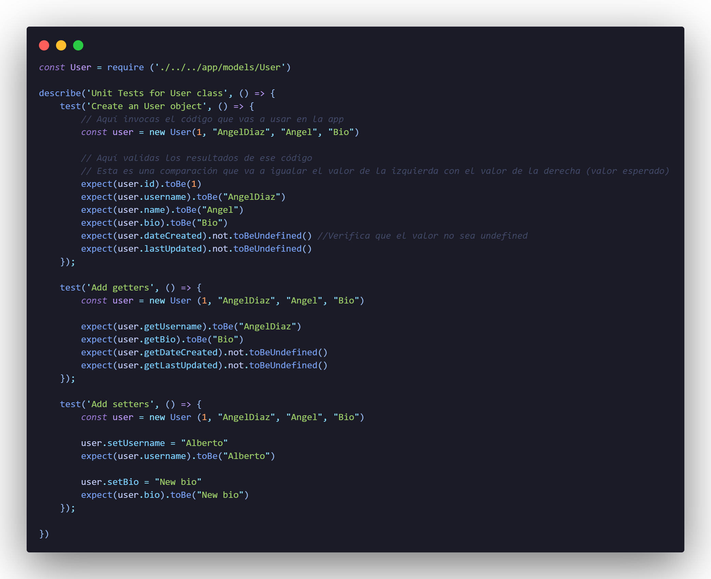
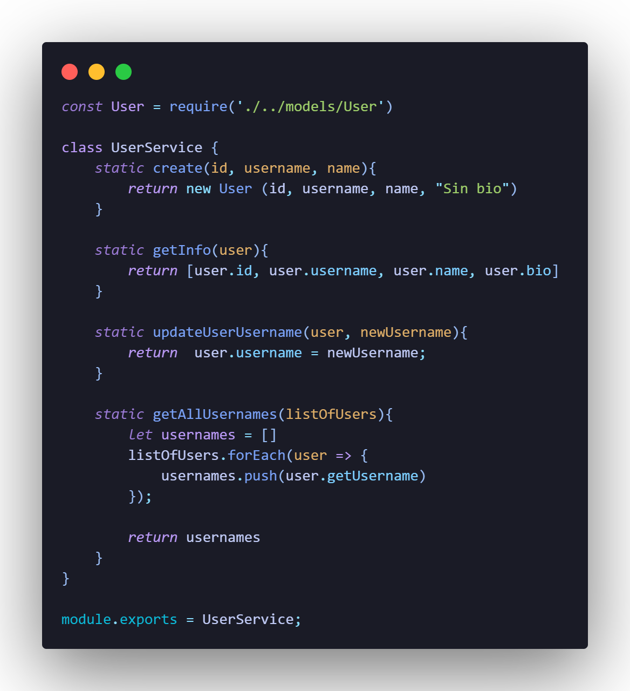
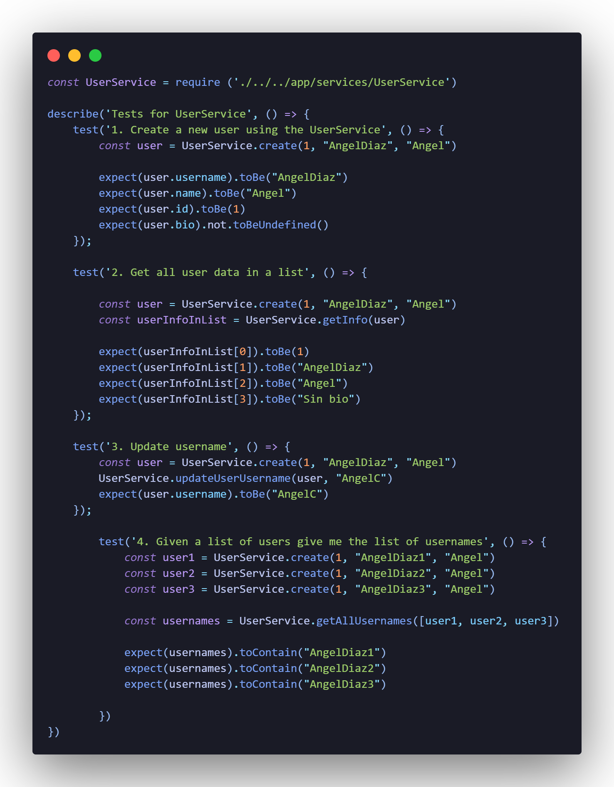
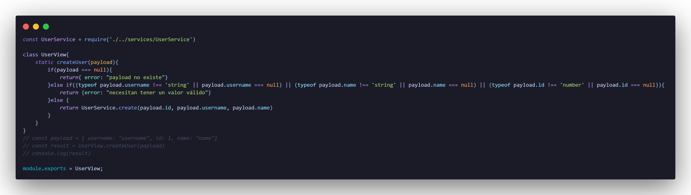
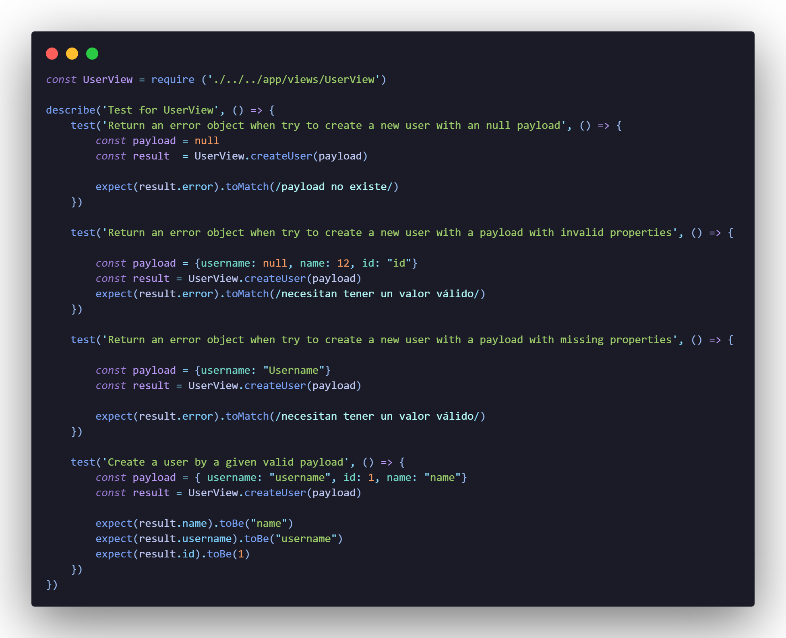

# Proyecto Twitter 

## Creación del proyecto
1. Crear un folder llamado twitter.
2. Ejecutar el comando *`npm init`* para inicializar el proyecto con JavaScript.
3. Agregar jest como dependencia con el comando *`npm install --save-dev jest`*.

Notas: 
* Agregar los folders *app* y *test* para colocar los diversos archivos que se vayan creando.
* En el archivo package.json modificar la siguiente línea de código que empieza con *`test`*, por:
```
"test": "node --experimental-vm-modules ./node_modules/jest/bin/jest.js"
```

Esto aplica solo para sistemas operativos Windows.

* Flujos para las pruebas

1. Escribe primero tu prueba con el caso a probar.
2. Verifica que tu prueba falle.
3. Escribe el código necesario.
4. Haz que la prueba pase.

<!-- TODO: Agregar imagen del directorio -->
* Estructura de carpetas

### Sprint 1: Agregar modelos - Creación de un modelo
**Requerimientos**

Requerimiento 1: Se necesita un modelo `User` para guardar la información de un usuario de nuestra app: `id`, `username`, `name`, `bio`, `dateCreated` y `lastUpdated`.   
Solución: Crear una clase User y un constructor que guarde estos parámetros. 
 
 Requerimiento 2: Las propiedades `dateCreated` y `lastUpdated` deberán ser datos de tipo fecha que guarden el momento en que se instancie un nuevo objeto de la clase `User`.  
 Solución: Modifica el constructor de la clase creada y asigna un valor por defecto a estos atributos usando `new Date()`.
 
 Requerimiento 3: Cada objeto tipo user necesita los siguietes gettes: `getUsername`, `getBio`, `getDateCreated`, `getLastUpdated`.  
 Solución: Agrega los getters regresando la propiedad indicada, no olvides usar `this`.
 
 Requerimiento 4: Cada objeto necesita los siguientes setters: `setUsername` y `setBio`, para actualizar dichas propiedades.  
 Solución: Agrega los setters usando la palabra `set` y modificando el atributo indicado.

**Archivo User.js**

 

**Test User.test.js**

 

### Sprint 2: Agregar Servicios
**Requerimientos: Interacción con el modelo**

Requerimiento 1: Crear un nuevo usuario con lo ya definido en el sprint anterior, usando una nueva clase llamada `UserService`.
Criterios de aceptación:
1. Esta clase deberá tener un método `create` que se pueda usar sin instanciar (static method), y que reciba solo los parámetros del `id`, `username` y `name`. 
2. El valor de `bio` deberá ser por default para todos los `user` creados.

Requerimiento 2: Agregar un nuevo método estático en `UserService` llamado `getInfo` que al recibir un objeto de la clase `User`, me regrese una lista con todos los valores de los atributos de dicho objeto.

Requerimiento 3: Agregar un nuevo método estático en `UserService` llamado `updateUserUsername`, que reciba un objeto de la clase `User` y un nuevo string, que actualizará el valor de `username`. 

Requerimiento 4: Agregar un nuevo método estático en `UserService` llamado `getAllUsernames`, que recibirá una lista de objetos de la clase `User`, y regresará la lista de todos los usernames de dichos objetos. 

**Archivo UserService.js**

 

**Test UserService.test.js**

 

### Sprint 3: Agregar vistas
**Requerimientos**

Crea una clase llamada `UserView` que servirá para interactuar con el modelo `User` a través de `userService`. Crea un método en esta clase llamado `create User` que sirva para crear un nuevo objeto user a partir de un `payload`, quiero decir un objeto que contenga información para crearlo.

1. Valida que al enviar en el `payload` un valor `null`, obtenga un objeto con la llave `error` y el valor indique `payload no existe`.
2. Valida que un `payload` contenga en alguna de las llaves `username`, `name`, o `id` un valor en `null`. Si hay un valor `null` regresa un objeto con la llave `error` y que indique el texto: `necesitan tener un valor válido`.
3. Valida que un `payload` con algunas de las propiedades necesarias regrese un objeto con la llave `error` indicando `necesitan tener un valor válido`.
4. Verifica que se pueda crear un objeto `User`, al enviar un payload con las siguientes propiedades: `username`, `id` y `name`.

**Archivo UserView.js**

 

**Test UserView.test.js**

 